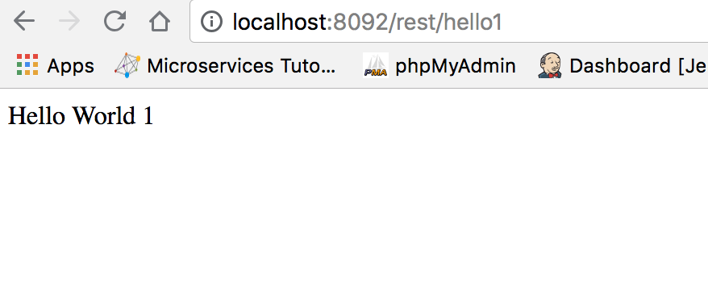
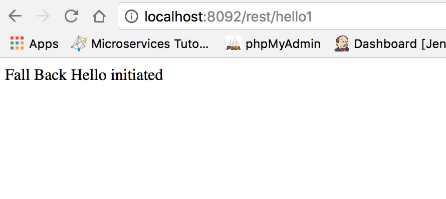
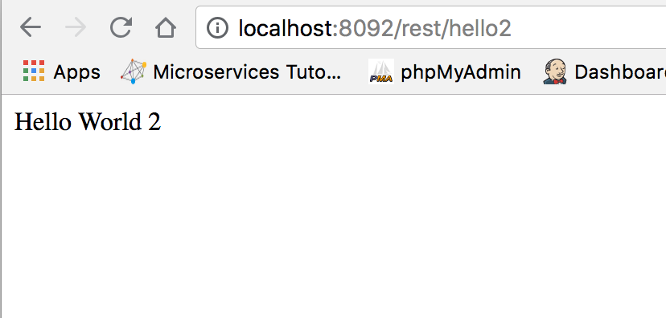
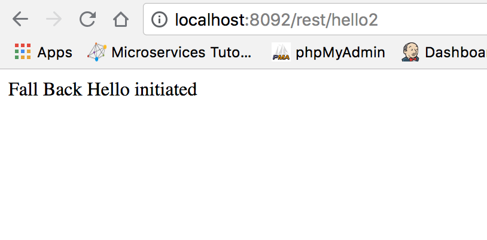
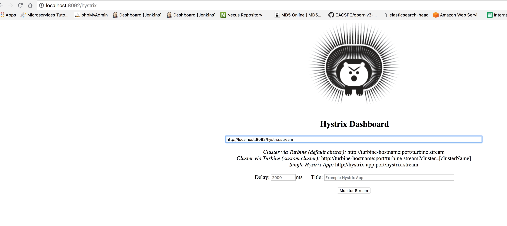
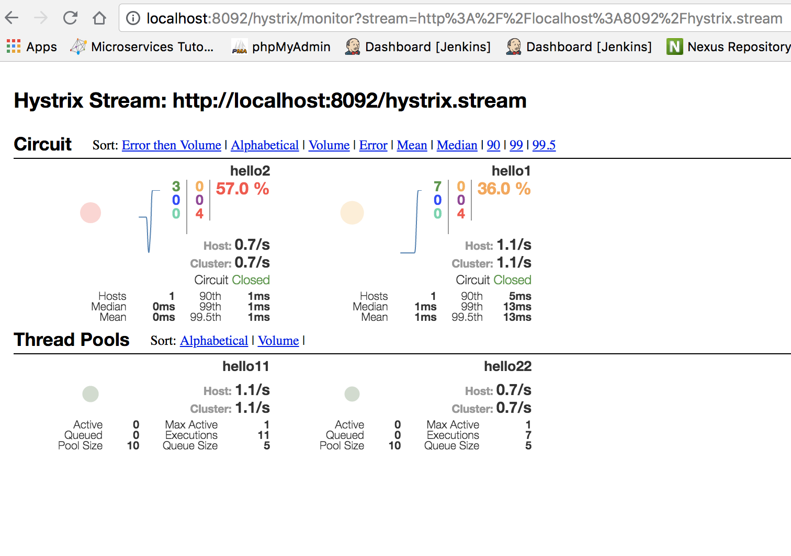

# Hystrix Dashboard Example

- `http://localhost:8092/rest/hello1` - URL for triggering Faults or success.

- `http://localhost:8092/rest/hello2` - URL for triggering Faults or success.

- `http://localhost:8092/hystrix` - URL for Hystrix Dashboard

- `http://localhost:8092/hystrix.stream` - URL for Hystrix Stream which can be configured with any Hystrix Dashboard or Turbine

